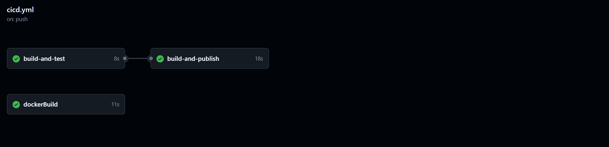
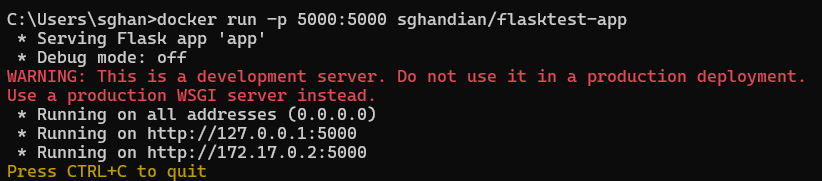

# CI/CD Minimal Pipeline for Python Applications

This repo provides a template one could use to start a project with aims to deploy to Docker Hub. It also provides a CI/CD pipeline contained in the cicd.yml file which outlines how one would execute basic tests on push or pull-request to the main branch. The dockerfile leverages a minimal python 3.10 image, sets the proper working directory, copies project files into it, and installs dependencies according to requirements.txt.

## Points to modify for your application

1. app.py with your own application
2. test_app.py with your own tests
3. requirements.txt with your project's dependencies
4. Add `DOCKER_USERNAME` and `DOCKER_PASSWORD` secrets to your Github repo's secrets.

Depending on your application's needs, you may need to modify the dockerfile and add/modify jobs in the CI/CD workflow.

## Testing out this particular docker image

To try out the docker image, which contains the simplest possible web app ("Hello World!"), do as follows:

1. Ensure you have installed Docker Desktop so that you have access to docker on the CLI.
2. Run:  `docker pull sghandian/flasktest-app`
3. Run:  `docker run -p 5000:5000 sghandian/flasktest-app`
4. Ctrl + Click on the first link (`http://127.0.0.1:5000`) to open the web application.

